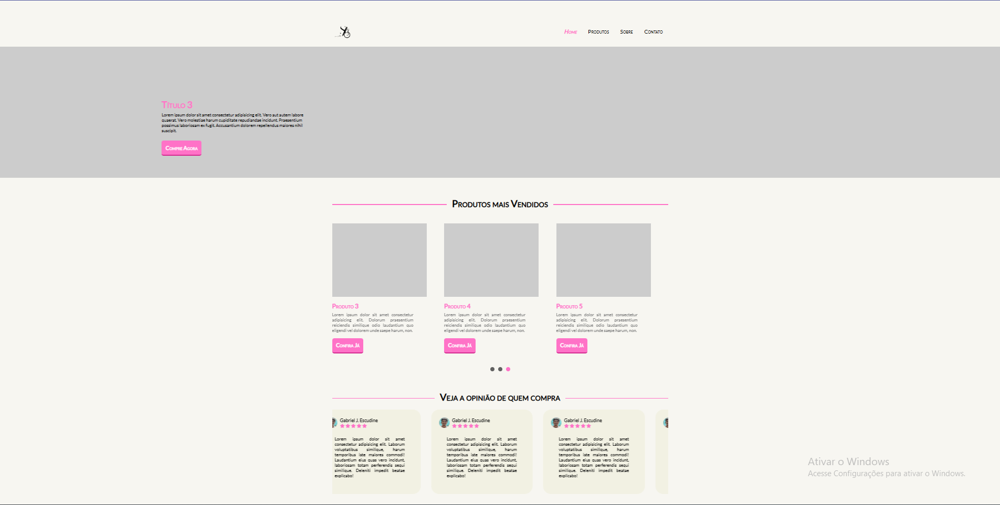

# 🔬 ScrapBook Store

## 📝 Descrição

Este projeto é um site desenvolvido do zero para uma loja virtual especializada em bottons com temas voltados para a área da saúde.
Desde o design até a implementação, cada detalhe foi pensado para criar uma experiência de compra intuitiva e agradável, conectando profissionais e entusiastas da saúde com acessórios únicos e temáticos.
 
 
Você pode acessar o site através deste link: [ScrapBook Store - Site](https://linkdoproyecto.com).

## 📬 Contatos

Gostou do projeto? Gostaria de saber mais sobre mim? Entre em contato!

- 📧 Email: [gabrieljescudine@gmail.com](mailto:gabrieljescudine@gmail.com)
- 💼 LinkedIn: [Gabriel Joffily Escudine](https://www.linkedin.com/in/gabrieljoffilyescudine/)
